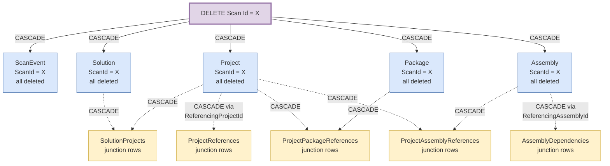

# DAO Manager - Entity Data Model Specification

**Version:** 2.0  
**Date:** February 6, 2026  
**Architecture:** Scan-Owned Snapshot Model  
**ID Strategy:** int (auto-increment)  

---

## Overview

This document specifies the entity data model for the DAO Manager application. The model implements a **scan-owned snapshot architecture** where each scan creates an immutable point-in-time snapshot of a repository's structure and dependencies.

### Design Principles

1. **Scan Ownership**: All data is owned by a Scan entity and cascades delete when the scan is deleted
2. **Snapshot Isolation**: Each scan is completely independent with no shared data between scans
3. **Normalized Within Scan**: Package and Assembly entities are normalized within a scan to reduce duplication
4. **Temporal Analysis**: Multiple scans enable dependency archaeology and drift detection over time

### Naming Conventions

- **Entity Classes**: Singular names (e.g., `Scan`, `Project`, `Package`) - used in C# code when working with individual instances
- **Database Tables**: Plural names (e.g., `Scans`, `Projects`, `Packages`) - signals that tables contain collections of entities
- **Junction Tables**: Plural/collection names (e.g., `SolutionProjects`, `ProjectReferences`) - represents collections of relationships

---

## Entities

### Scan

**Entity Class**: `Scan` (singular)  
**Database Table**: `Scans` (plural)

**Description**: Root aggregate representing a single scan of a repository at a specific commit.

**Properties**:
- `Id` (PK): int, auto-increment
- `RepositoryPath`: string, not null, max 2000 chars
- `GitCommit`: string, not null, max 100 chars (full commit hash)
- `ScanDate`: DateTime, not null
- `CreatedAt`: DateTime, not null, defaults to UTC now

**Relationships**:
- One-to-Many → ScanEvent (cascade delete)
- One-to-Many → Solution (cascade delete)
- One-to-Many → Project (cascade delete)
- One-to-Many → Package (cascade delete)
- One-to-Many → Assembly (cascade delete)

**Indexes**:
- Primary Key on `Id`
- Index on `ScanDate`
- Index on `CreatedAt`
- Index on `GitCommit`

**Constraints**:
- `RepositoryPath` must not be empty
- `GitCommit` must not be empty

---

### ScanEvent

**Entity Class**: `ScanEvent` (singular)  
**Database Table**: `ScanEvents` (plural)

**Description**: Records detailed progress events during scan execution (verbose logging).

**Properties**:
- `Id` (PK): int, auto-increment
- `ScanId` (FK): int, not null → Scan.Id (cascade delete)
- `OccurredAt`: DateTime, not null, defaults to UTC now
- `Phase`: string, not null, max 100 chars
- `Message`: string, not null, max 2000 chars

**Relationships**:
- Many-to-One → Scan (parent)

**Indexes**:
- Primary Key on `Id`
- Index on `ScanId`
- Index on `ScanId, OccurredAt` (for temporal queries)

**Constraints**:
- `ScanId` must reference existing Scan
- `Phase` must not be empty
- `Message` must not be empty

**Cascade Behavior**:
- ON DELETE CASCADE from Scan

---

### Solution

**Entity Class**: `Solution` (singular)  
**Database Table**: `Solutions` (plural)

**Description**: Represents a Visual Studio Solution file (.sln) found during the scan.

**Properties**:
- `Id` (PK): int, auto-increment
- `ScanId` (FK): int, not null → Scan.Id (cascade delete)
- `UniqueIdentifier`: string, not null, max 100 chars (hash of file path)
- `VisualStudioGuid`: string, nullable, max 100 chars
- `FilePath`: string, not null, max 2000 chars
- `Name`: string, not null, max 255 chars

**Relationships**:
- Many-to-One → Scan (parent)
- Many-to-Many ↔ Project (via SolutionProjects junction)

**Indexes**:
- Primary Key on `Id`
- Index on `ScanId`
- Unique Index on `ScanId, UniqueIdentifier`
- Index on `FilePath`

**Constraints**:
- `ScanId` must reference existing Scan
- `UniqueIdentifier` must be unique within scan
- `FilePath` must not be empty

**Cascade Behavior**:
- ON DELETE CASCADE from Scan

---

### Project

**Entity Class**: `Project` (singular)  
**Database Table**: `Projects` (plural)

**Description**: Represents a project file (.csproj, .vbproj, etc.) found during the scan.

**Properties**:
- `Id` (PK): int, auto-increment
- `ScanId` (FK): int, not null → Scan.Id (cascade delete)
- `UniqueIdentifier`: string, not null, max 100 chars (hash of file path)
- `VisualStudioGuid`: string, nullable, max 100 chars
- `Name`: string, not null, max 255 chars
- `FilePath`: string, not null, max 2000 chars
- `TargetFramework`: string, nullable, max 100 chars

**Relationships**:
- Many-to-One → Scan (parent)
- Many-to-Many ↔ Solution (via SolutionProjects junction)
- Many-to-Many ↔ Project (via ProjectReferences junction, self-referencing)
- Many-to-Many ↔ Package (via ProjectPackageReferences junction)
- Many-to-Many ↔ Assembly (via ProjectAssemblyReferences junction)

**Indexes**:
- Primary Key on `Id`
- Index on `ScanId`
- Unique Index on `ScanId, UniqueIdentifier`
- Index on `FilePath`
- Index on `Name`

**Constraints**:
- `ScanId` must reference existing Scan
- `UniqueIdentifier` must be unique within scan
- `FilePath` must not be empty
- `Name` must not be empty

**Cascade Behavior**:
- ON DELETE CASCADE from Scan

---

### Package

**Entity Class**: `Package` (singular)  
**Database Table**: `Packages` (plural)

**Description**: Represents a NuGet package found in project references. Normalized within scan (one record per unique package name+version combination per scan).

**Properties**:
- `Id` (PK): int, auto-increment
- `ScanId` (FK): int, not null → Scan.Id (cascade delete)
- `Name`: string, not null, max 255 chars
- `Version`: string, not null, max 50 chars

**Relationships**:
- Many-to-One → Scan (parent)
- Many-to-Many ↔ Project (via ProjectPackageReferences junction)

**Indexes**:
- Primary Key on `Id`
- Index on `ScanId`
- Unique Index on `ScanId, Name, Version`
- Index on `Name`

**Constraints**:
- `ScanId` must reference existing Scan
- `Name` must not be empty
- `Version` must not be empty
- Combination of `ScanId, Name, Version` must be unique

**Cascade Behavior**:
- ON DELETE CASCADE from Scan

**Notes**:
- Packages are normalized within a scan to avoid duplicate records for the same package
- Same package in different scans will have separate records (scan isolation)

---

### Assembly

**Entity Class**: `Assembly` (singular)  
**Database Table**: `Assemblies` (plural)

**Description**: Represents a compiled assembly (DLL, EXE) referenced by projects. Normalized within scan.

**Properties**:
- `Id` (PK): int, auto-increment
- `ScanId` (FK): int, not null → Scan.Id (cascade delete)
- `Name`: string, not null, max 255 chars (file name without extension)
- `Type`: string, not null, max 20 chars (e.g., "dll", "exe")
- `FilePath`: string, not null, max 2000 chars
- `Version`: string, nullable, max 50 chars

**Relationships**:
- Many-to-One → Scan (parent)
- Many-to-Many ↔ Project (via ProjectAssemblyReferences junction)
- Many-to-Many ↔ Assembly (via AssemblyDependencies junction, self-referencing)

**Indexes**:
- Primary Key on `Id`
- Index on `ScanId`
- Unique Index on `ScanId, FilePath`
- Index on `Name`

**Constraints**:
- `ScanId` must reference existing Scan
- `Name` must not be empty
- `Type` must not be empty
- `FilePath` must not be empty
- Combination of `ScanId, FilePath` must be unique

**Cascade Behavior**:
- ON DELETE CASCADE from Scan

**Notes**:
- Assemblies are normalized within a scan to avoid duplicate records
- Same assembly in different scans will have separate records (scan isolation)

---

## Junction Tables

### SolutionProjects

**Entity Class**: N/A (junction table only)  
**Database Table**: `SolutionProjects` (plural)

**Description**: Many-to-many relationship between Solutions and Projects.

**Properties**:
- `SolutionId` (PK, FK): int, not null → Solution.Id (cascade delete)
- `ProjectId` (PK, FK): int, not null → Project.Id (cascade delete)

**Primary Key**: Composite (`SolutionId`, `ProjectId`)

**Indexes**:
- Primary Key on (`SolutionId`, `ProjectId`)
- Index on `ProjectId` (for reverse lookups)

**Constraints**:
- `SolutionId` must reference existing Solution
- `ProjectId` must reference existing Project
- Combination must be unique

**Cascade Behavior**:
- ON DELETE CASCADE from Solution (deletes junction row)
- ON DELETE CASCADE from Project (deletes junction row)

---

### ProjectReferences

**Entity Class**: N/A (junction table only)  
**Database Table**: `ProjectReferences` (plural)

**Description**: Many-to-many self-referencing relationship representing project-to-project references.

**Properties**:
- `ReferencingProjectId` (PK, FK): int, not null → Project.Id (cascade delete)
- `ReferencedProjectId` (PK, FK): int, not null → Project.Id (no action)

**Primary Key**: Composite (`ReferencingProjectId`, `ReferencedProjectId`)

**Indexes**:
- Primary Key on (`ReferencingProjectId`, `ReferencedProjectId`)
- Index on `ReferencedProjectId` (for reverse lookups)

**Constraints**:
- `ReferencingProjectId` must reference existing Project
- `ReferencedProjectId` must reference existing Project
- Combination must be unique
- Self-reference allowed (though logically should not occur)

**Cascade Behavior**:
- ON DELETE CASCADE from ReferencingProjectId (deletes junction row)
- ON DELETE NO ACTION from ReferencedProjectId (avoid circular cascade conflicts)

**Notes**:
- NO ACTION on ReferencedProjectId prevents SQL Server cascade path conflicts
- Junction rows are cleaned up when Scan is deleted (via Project cascade)

---

### ProjectPackageReferences

**Entity Class**: N/A (junction table only)  
**Database Table**: `ProjectPackageReferences` (plural)

**Description**: Many-to-many relationship between Projects and Packages.

**Properties**:
- `ProjectId` (PK, FK): int, not null → Project.Id (cascade delete)
- `PackageId` (PK, FK): int, not null → Package.Id (cascade delete)

**Primary Key**: Composite (`ProjectId`, `PackageId`)

**Indexes**:
- Primary Key on (`ProjectId`, `PackageId`)
- Index on `PackageId` (for reverse lookups)

**Constraints**:
- `ProjectId` must reference existing Project
- `PackageId` must reference existing Package
- Combination must be unique

**Cascade Behavior**:
- ON DELETE CASCADE from Project (deletes junction row)
- ON DELETE CASCADE from Package (deletes junction row)

---

### ProjectAssemblyReferences

**Entity Class**: N/A (junction table only)  
**Database Table**: `ProjectAssemblyReferences` (plural)

**Description**: Many-to-many relationship between Projects and Assemblies.

**Properties**:
- `ProjectId` (PK, FK): int, not null → Project.Id (cascade delete)
- `AssemblyId` (PK, FK): int, not null → Assembly.Id (cascade delete)

**Primary Key**: Composite (`ProjectId`, `AssemblyId`)

**Indexes**:
- Primary Key on (`ProjectId`, `AssemblyId`)
- Index on `AssemblyId` (for reverse lookups)

**Constraints**:
- `ProjectId` must reference existing Project
- `AssemblyId` must reference existing Assembly
- Combination must be unique

**Cascade Behavior**:
- ON DELETE CASCADE from Project (deletes junction row)
- ON DELETE CASCADE from Assembly (deletes junction row)

---

### AssemblyDependencies

**Entity Class**: N/A (junction table only)  
**Database Table**: `AssemblyDependencies` (plural)

**Description**: Many-to-many self-referencing relationship representing assembly-to-assembly dependencies.

**Properties**:
- `ReferencingAssemblyId` (PK, FK): int, not null → Assembly.Id (cascade delete)
- `ReferencedAssemblyId` (PK, FK): int, not null → Assembly.Id (no action)

**Primary Key**: Composite (`ReferencingAssemblyId`, `ReferencedAssemblyId`)

**Indexes**:
- Primary Key on (`ReferencingAssemblyId`, `ReferencedAssemblyId`)
- Index on `ReferencedAssemblyId` (for reverse lookups)

**Constraints**:
- `ReferencingAssemblyId` must reference existing Assembly
- `ReferencedAssemblyId` must reference existing Assembly
- Combination must be unique
- Self-reference allowed (though logically should not occur)

**Cascade Behavior**:
- ON DELETE CASCADE from ReferencingAssemblyId (deletes junction row)
- ON DELETE NO ACTION from ReferencedAssemblyId (avoid circular cascade conflicts)

**Notes**:
- NO ACTION on ReferencedAssemblyId prevents SQL Server cascade path conflicts
- Junction rows are cleaned up when Scan is deleted (via Assembly cascade)

---

## Cascade Delete Strategy

### Primary Cascade Path

When a row in the `Scans` table is deleted, the following cascade occurs:



**Legend**:
- **Solid arrows (→)**: Direct CASCADE from Scan to main entities
- **Dashed arrows (⋯→)**: CASCADE from entities to junction tables (deletes junction row only)
- **Purple**: Root aggregate (Scan)
- **Blue**: Main entities (own data via ScanId)
- **Yellow**: Junction tables (many-to-many relationships)

### Avoiding Cascade Conflicts

SQL Server does not allow multiple cascade paths to the same table. This model avoids conflicts by:

1. **All entities own their data via ScanId**: Every main entity has a direct FK to Scan
2. **Junction tables cascade from both sides**: But only to delete the junction row
3. **Self-referencing junctions use NO ACTION**: On one FK to prevent circular cascades
4. **No cascades from junction to main entities**: Junction tables never cascade back to entities

This ensures clean deletion without triggering SQL Server error 1785 (multiple cascade paths).

---

## Entity Relationship Diagram


---

## Implementation Notes

### EF Core Configuration

- Use Fluent API in `OnModelCreating` for all configurations
- Explicitly configure all cascade behaviors (don't rely on conventions)
- Use composite keys for junction tables
- Configure string length limits on all string properties
- Add indexes for commonly queried fields

### Transaction Scope

- Each scan operation should run in a single transaction
- If scan fails mid-process, rollback entire scan
- ScanEvents should be flushed periodically during long scans

### Performance Considerations

- ScanEvents can generate large volumes of data (verbose logging)
- Consider pagination for ScanEvent queries
- Add indexes on temporal fields (OccurredAt, ScanDate, CreatedAt)
- Composite indexes for common query patterns

### Data Integrity

- Use database transactions to ensure atomic scan operations
- Validate file paths before insertion
- Generate UniqueIdentifiers consistently (e.g., SHA256 hash of normalized path)
- Ensure GUIDs are normalized (uppercase/lowercase)

### Migration Strategy

- Create new tables with `v2_` prefix initially
- Migrate existing data to new structure
- Drop old tables after validation
- Keep old migration history for reference

---

## Change Log

### Version 2.0 (February 6, 2026)

**Breaking Changes**:
- Changed from denormalized to normalized Package/Assembly entities
- Added ScanId to all main entities for direct ownership
- Changed Solution/Project relationship from denormalized to many-to-many junction table
- Removed direct FK from Project to Solution
- Changed ScanEvent from denormalized to owned by Scan

**New Entities**:
- Package (normalized within scan)
- Assembly (normalized within scan)

**New Junction Tables**:
- SolutionProjects
- ProjectReferences
- ProjectPackageReferences
- ProjectAssemblyReferences
- AssemblyDependencies

**Removed Direct Relationships**:
- Project.SolutionId removed (now via junction)
- PackageReference entity removed (now junction + Package)
- AssemblyReference entity removed (now junction + Assembly)

**Cascade Behavior Changes**:
- All entities now cascade from Scan
- Junction tables cascade from both parent entities
- Self-referencing junctions use NO ACTION on one FK

---

## Appendix: Sample Queries

### Query 1: Get all packages used in a scan
```sql
SELECT DISTINCT p.Name, p.Version, COUNT(DISTINCT pr.ProjectId) AS ProjectCount
FROM Packages p
INNER JOIN ProjectPackageReferences pr ON p.Id = pr.PackageId
WHERE p.ScanId = @ScanId
GROUP BY p.Id, p.Name, p.Version
ORDER BY ProjectCount DESC, p.Name;
```

### Query 2: Find project dependencies
```sql
SELECT 
    refing.Name AS ReferencingProject,
    refed.Name AS ReferencedProject
FROM ProjectReferences pr
INNER JOIN Projects refing ON pr.ReferencingProjectId = refing.Id
INNER JOIN Projects refed ON pr.ReferencedProjectId = refed.Id
WHERE refing.ScanId = @ScanId;
```

### Query 3: Compare packages between two scans
```sql
-- Packages in Scan2 but not in Scan1 (new packages)
SELECT p2.Name, p2.Version
FROM Packages p2
WHERE p2.ScanId = @Scan2Id
  AND NOT EXISTS (
      SELECT 1 FROM Packages p1 
      WHERE p1.ScanId = @Scan1Id 
        AND p1.Name = p2.Name 
        AND p1.Version = p2.Version
  );
```

### Query 4: Get scan progress events
```sql
SELECT 
    OccurredAt,
    Phase,
    Message
FROM ScanEvents
WHERE ScanId = @ScanId
ORDER BY OccurredAt ASC;
```

### Query 5: Find all solutions containing a specific project
```sql
SELECT s.Name, s.FilePath
FROM Solutions s
INNER JOIN SolutionProjects sp ON s.Id = sp.SolutionId
INNER JOIN Projects p ON sp.ProjectId = p.Id
WHERE p.ScanId = @ScanId
  AND p.Name = @ProjectName;
```

---

**End of Specification**
